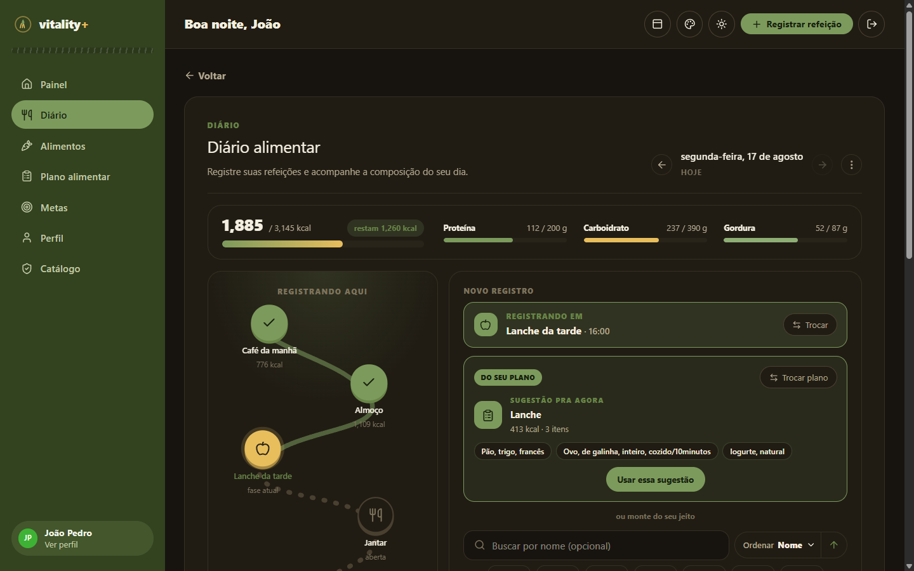
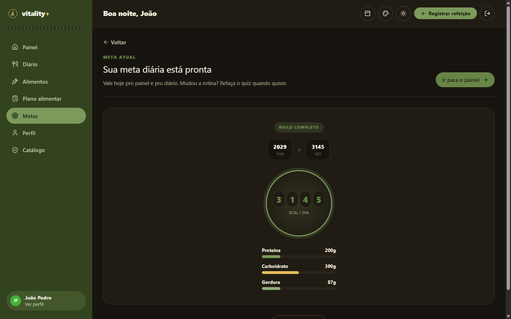
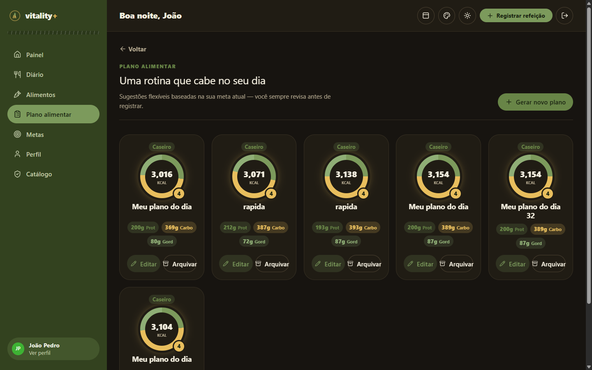
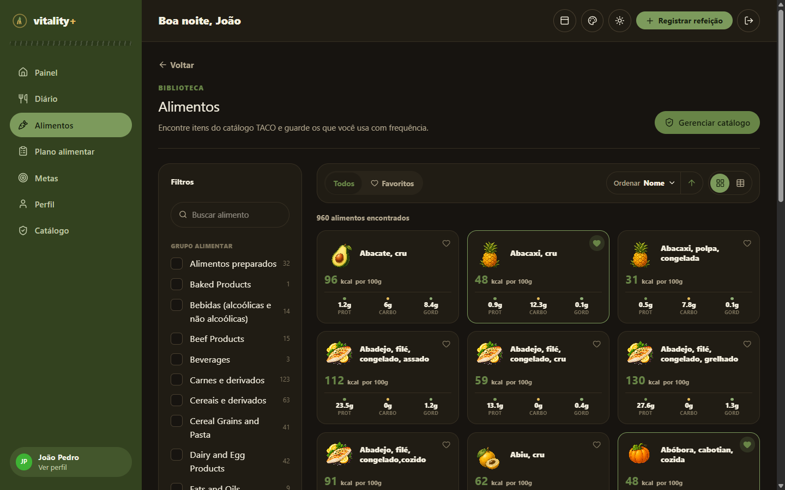

<div align="center">

# 🌱 Vitality PLUS


**Nutrição com propósito.**

Meta calórica sem planilha, sem fórmula que ninguém entende. Um quiz guiado revela — passo a
passo — a meta ideal de calorias e macros de cada pessoa a partir do próprio perfil e rotina. Dali
em diante, é o hub diário de quem quer comer melhor sem perder a cabeça.

</div>

<br>

<p align="center">
  
</p>

<p align="center">
  <sub><b>Diário alimentar</b> — cada refeição do dia numa trilha navegável, com sugestão do plano ativo pronta pra registrar.</sub>
</p>

<br>

Este repositório é o **frontend** do produto: uma single-page application em Angular que consome a
API do backend Laravel (`../vitality-Back`).

Para preparar o catálogo no backend, execute `php artisan migrate --seed`; o seeder importa a TACO
de forma idempotente. Para enriquecer o catálogo com os nutrientes detalhados da base USDA
Foundation Foods, execute também `php artisan foods:import-usda --dataset=foundation`. A primeira conta administrativa é promovida com
`php artisan user:make-admin email@dominio.com`.

## O produto

<table>
<tr>
<td width="50%" valign="top">

### 🎯 Quiz de metas

Em vez de um formulário longo, a meta calórica e de macros nasce de um fluxo em 4 passos (perfil →
rotina e objetivo → sugestão calculada → confirmação), com a identidade de um quiz/jogo de
verdade: cartões tocáveis, revelação animada do resultado, trilha de progresso navegável a
qualquer momento. O cálculo usa a fórmula de Mifflin-St Jeor (TMB) mais fator de atividade — a
mesma base científica usada por nutricionistas, sem exigir que o usuário saiba o que isso
significa.

</td>
<td width="50%" valign="top">

</td>
</tr>
<tr>
<td width="50%" valign="top">

### 📋 Dietas geradas por IA

O plano nasce de um quiz curto (quantas refeições por dia → estilo que ajuda na rotina → o que
evitar) e o backend usa **IA generativa (Google Gemini)** pra montar o cardápio do zero a partir
dessas respostas e da meta calórica/macros já calculada — não é uma lista fixa nem um sorteio entre
alimentos pré-cadastrados. Cada refeição pode ser regenerada individualmente ou o dia inteiro pode
ser recriado, e trocar um alimento específico também pede sugestões novas à IA, sempre mantendo a
refeição próxima da meta. O plano vira um crachá com anel de macros, reaproveitável sempre que
quiser sem remontar a lista do zero, e pronto pra virar sugestão dentro do Diário.

</td>
<td width="50%" valign="top">

</td>
</tr>
<tr>
<td width="50%" valign="top">

### 🥗 Biblioteca de alimentos

Catálogo global curado, iniciado pela TACO e enriquecido com a USDA Foundation Foods, com
favoritos pessoais, busca facetada por categoria e administração restrita para manter dados
nutricionais confiáveis.

</td>
<td width="50%" valign="top">

</td>
</tr>
</table>

- 🍽️ **Diário alimentar** — uma jornada diária de checkpoints: registra refeições num mini-quiz de
  momento → prato → porções, compara com a meta e mantém o histórico editável (screenshot no topo
  da página).
- 📊 **Painel de acompanhamento** — meta vs. consumido, num relance.
- 👤 **Perfil em etapas** — identidade e avatar → corpo → rotina e confirmação. Cada avanço é salvo
  imediatamente, reduzindo perda de dados e mantendo a meta alinhada ao perfil atual.

Áreas com ✅ já implementadas e testadas ponta a ponta contra o backend real: autenticação, quiz de
metas/recomendação nutricional, perfil completo (dados pessoais, rotina e avatar) e Diário Alimentar.
Dietas e dashboard seguem em desenvolvimento incremental.

## Identidade visual

A identidade visual é única e acompanha a escolha de cada pessoa em todo o produto — área
autenticada, login e cadastro. O seletor de paleta fica na topbar e a preferência é persistida no
navegador; ela também é aplicada antes do Angular iniciar para evitar flash de cor incorreta.

- **Horta** (padrão) — primary verde, com menu/poster verde-floresta.
- **Especiaria** — primary terracota, com menu/poster ameixa.
- **Sálvia** — primary verde-sálvia, com menu/poster grafite quente.
- **Ameixa Reversa** — primary ameixa, com menu/poster marrom-terra.

As quatro paletas alteram somente o primary e o chrome do menu/pôster; mostarda, superfícies,
bordas e texto continuam definidos pelo tema claro ou escuro. A topbar acompanha a responsividade:
em desktop exibe o CTA por extenso, em tablet o compacta e, no mobile, transforma as ações —
incluindo registrar refeição — em controles só de ícone com tooltips posicionadas abaixo do header.

## Stack técnica

| Camada            | Tecnologia                                                                                  |
| ----------------- | ------------------------------------------------------------------------------------------- |
| Framework         | Angular 20 — standalone components, Signals, `inject()`, lazy loading por rota              |
| Design system     | [bandeira-ui](https://www.npmjs.com/package/bandeira-ui) (biblioteca própria do autor)      |
| Estilo            | Tailwind v4 (CSS-first) — utilitário sempre que possível, SCSS só onde Tailwind não alcança |
| Ícones            | [Lucide](https://lucide.dev) via `@lucide/angular`                                          |
| Notificações      | ngx-toastr                                                                                  |
| Linguagem         | TypeScript strict                                                                           |
| Testes            | Jasmine / Karma                                                                             |
| Backend consumido | Laravel + Sanctum (Bearer token), em `../vitality-Back`                                     |
| Geração de planos | IA generativa (Google Gemini), acionada pelo backend a partir das respostas do quiz de dietas |

A organização de pastas do código está detalhada em [`ESTRUTURA.md`](./ESTRUTURA.md).

## Rodando localmente

Pré-requisitos: Node.js compatível com Angular 20 (LTS atual) e o backend em `../vitality-Back`
rodando em paralelo.

```bash
npm install
npm start          # http://localhost:4200
```

Em outro terminal, dentro de `../vitality-Back`:

```bash
php artisan serve  # http://localhost:8000
```

O `.env` do backend precisa ter `FRONTEND_URL=http://localhost:4200` (necessário pro CORS liberar
o Angular).

### Scripts disponíveis

| Comando         | O que faz                                                                         |
| --------------- | --------------------------------------------------------------------------------- |
| `npm start`     | Sobe o dev server (`ng serve`) em `http://localhost:4200`, com reload automático. |
| `npm run build` | Build de produção, otimizado, em `dist/`.                                         |
| `npm test`      | Roda a suíte de testes (Jasmine/Karma).                                           |

## Estrutura de pastas

```
src/app/
  core/         auth, http, models, layout (app-shell, tema)
  components/   atoms/molecules/organisms/pipes/utils/directives reutilizáveis
  services/     todo service que fala com o backend (HttpClient)
  features/     uma pasta por área do produto (auth, metas, alimentos, diário, dietas, perfil...)
```

Os critérios completos de organização — o que nasce em `components/` vs. dentro de uma `feature/`,
por que `services/` é plano sem subpasta por feature — estão em
[`ESTRUTURA.md`](./ESTRUTURA.md).
